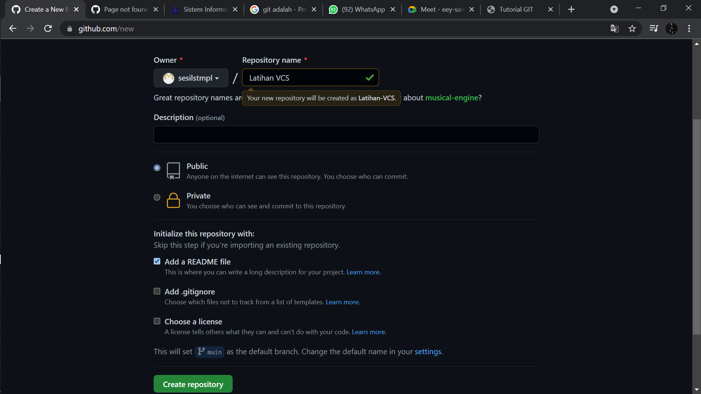

# Latihan-VCS
## Belajar GIT

### Apa Itu GIT?
Git adalah Version Control System yang digunakan oleh para developer untuk mengembangkan software secara bersama-sama
Berikut adalah tutorial menggunakan Git 
1. Buka github.com lalu create new repository dengan nama "Latihan VCS" dengan settingan publik dan add README file

Lalu buka file Readme tersebut, dan isi 
