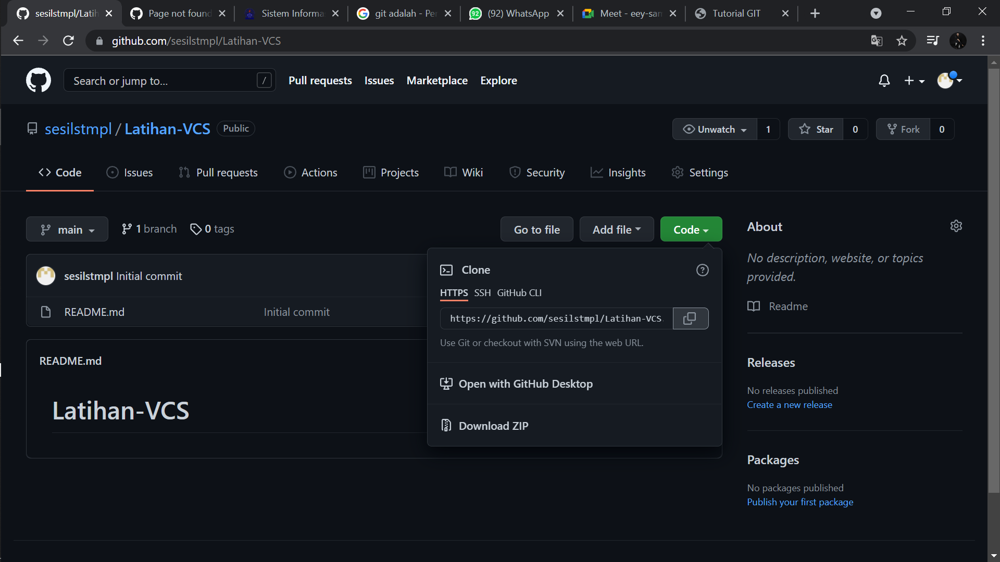
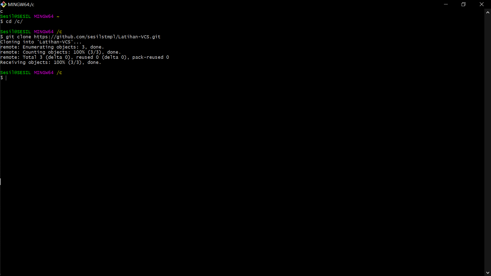
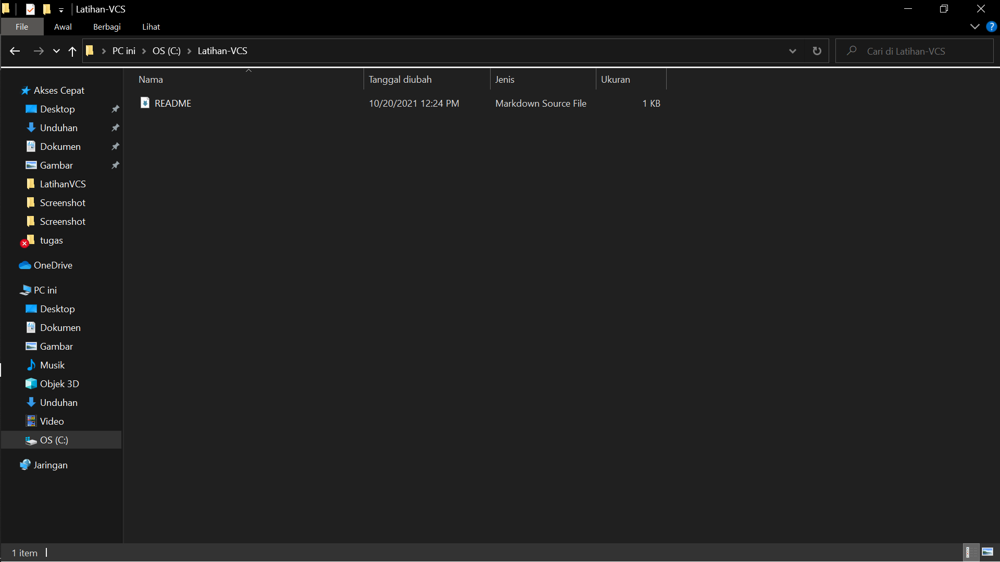
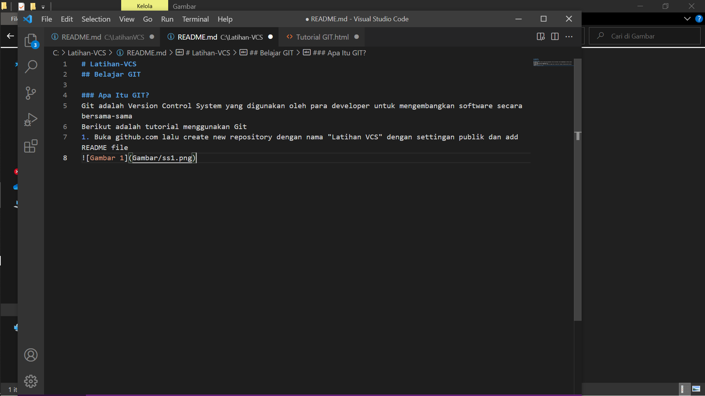
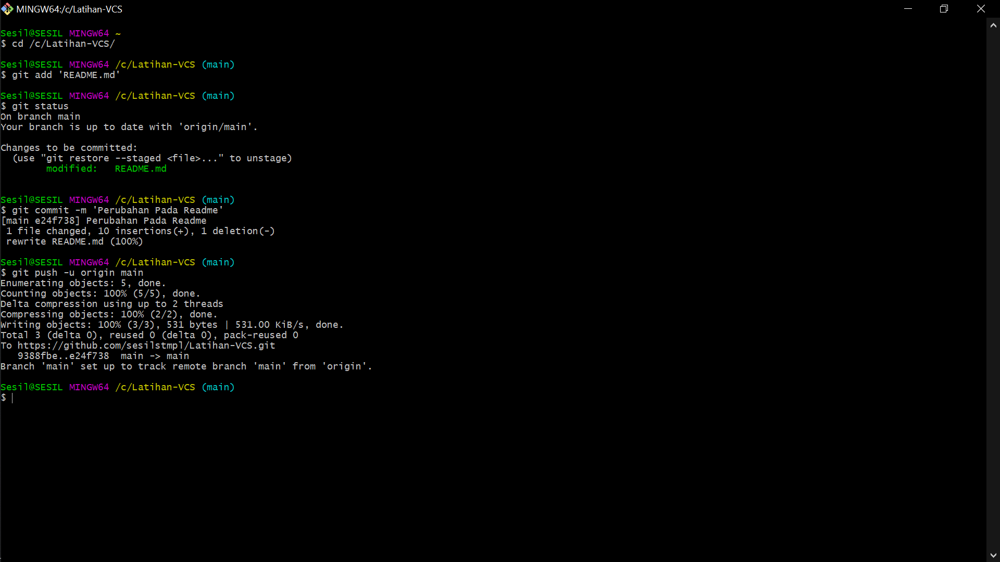

# Latihan-VCS
## Belajar GIT

### Apa Itu GIT?
Git adalah Version Control System yang digunakan oleh para developer untuk mengembangkan software secara bersama-sama
Berikut adalah tutorial menggunakan Git 
1. Buka github.com lalu create new repository dengan nama "Latihan VCS" dengan settingan publik dan add README file

2. Setelah itu copy link repositorynya

3. Lalu buka Git Bash
4. Karena kita ingin membuat repositorynya pada date C, maka ketik cd /c/ lalu git clone dan paste link repositorynya, maka akan muncul seperti ini

5. Lalu buka file pada data C, dan repositorynya sudah ada di data C

6. Lalu buka file readme tersebut, dan isi sesuai keinginan. Misalnya seperti ini

Setelah itu kembali lagi ke git, ketik git status. Karena kita telah merubah isi readme nya, maka kita ketik git add 'README.md' lalu ketik git commit -m 'Perubahan Pada Readme' dan ketik git push -u origin main untuk menambahkan pembaruan readme tersebut dalam repository github.

